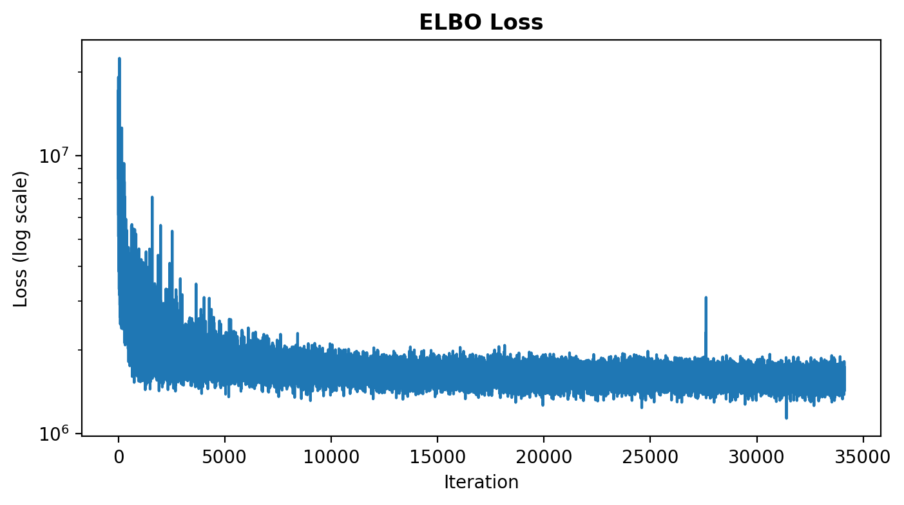
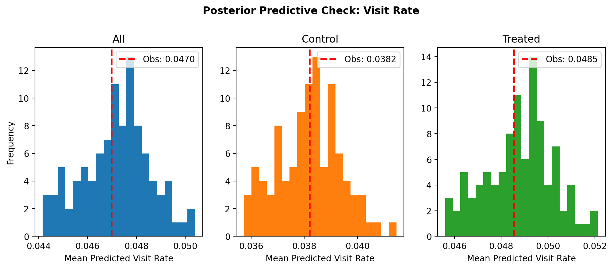
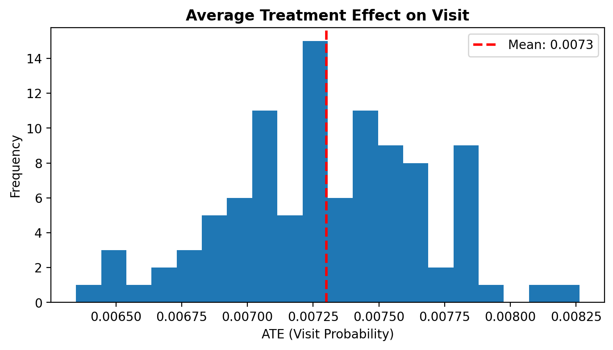

Scalable Predictive Sampling
============================

This example uses the `Criteo Uplift Prediction dataset
<https://ailab.criteo.com/criteo-uplift-prediction-dataset/>`_,
a large-scale advertising benchmark with approximately 14 million observations, to
demonstrate aimz's scalable inference pipeline: minibatch stochastic variational
inference (SVI) with :meth:`~aimz.ImpactModel.fit`, streaming posterior predictive
sampling to Zarr_ with :meth:`~aimz.ImpactModel.predict`, and deterministic resource
cleanup with :meth:`~aimz.ImpactModel.cleanup`.

The model is a Bayesian neural network (BNN) built with
`Flax <https://flax.readthedocs.io/>`_ and lifted into NumPyro_ through
:external:func:`~numpyro.contrib.module.random_nnx_module`.
Treatment is passed as an input feature, and the :class:`~aimz.ImpactModel` API handles
batched training and prediction without requiring changes to the model code.

.. code-block:: python

    import jax
    import jax.numpy as jnp
    import matplotlib.pyplot as plt
    import numpy as np
    import numpyro.distributions as dist
    import pandas as pd
    from flax import nnx
    from jax import Array, default_backend, random
    from jax.typing import ArrayLike
    from numpyro import deterministic, plate, sample
    from numpyro.contrib.module import random_nnx_module
    from numpyro.infer import SVI, Trace_ELBO, init_to_uniform
    from numpyro.infer.autoguide import AutoNormal
    from optax import adam

    from aimz import ImpactModel

    # Configure the inline backend for high-resolution figures
    %config InlineBackend.figure_format = "retina"

    # Set a random seed for reproducibility
    rng_key = random.key(532)

The Criteo Uplift Dataset
-------------------------

The Criteo Uplift Prediction dataset (v2.1) was constructed from several randomized
incrementality tests in online advertising.
In each test, a random subset of users was withheld from ad targeting (control) while
the remainder was eligible for ads (treated).
The treatment group is deliberately large (~85%) because withholding ads from control
users has a direct revenue cost.
The dataset contains approximately 14 million rows, each corresponding to a user with 12
anonymized features (``f0`` through ``f11``), a binary treatment indicator, and two
binary outcomes.
The dataset is also available from
`Hugging Face <https://huggingface.co/datasets/criteo/criteo-uplift>`_
(~300 MB compressed).

.. code-block:: python

    df = pd.read_parquet("criteo.parquet")

The dataset contains the following columns:

- **Features**: ``f0`` through ``f11``, 12 dense float-valued covariates.
  Feature names are anonymized and values are randomly projected to preserve
  predictive power while preventing recovery of the original user context.

- **Treatment**: ``treatment``, binary indicator (1 = user was eligible for
  ad targeting, 0 = withheld from targeting).  Note that ``treatment = 1``
  does not guarantee the user saw an ad; it means they were eligible for
  targeting in the real-time bidding auction.

- **Exposure**: ``exposure``, binary indicator of whether the user was
  actually shown an ad.  By construction, ``treatment = 0`` implies
  ``exposure = 0``.  Because exposure occurs after treatment assignment and
  depends on auction dynamics, conditioning on it would introduce
  post-treatment bias.  The analysis uses ``treatment`` alone, yielding an
  intention-to-treat (ITT) estimate.

- **Outcomes**:

  - ``visit``: whether the user visited the advertiser's site (binary, ~4.7%).
  - ``conversion``: whether a purchase occurred (binary, ~0.3%).
    By construction, ``visit = 0`` implies ``conversion = 0``.

We model ``visit`` as the outcome because its higher base rate (~4.7% vs.
~0.3%) makes the treatment effect easier to detect.  The conversion outcome
could be modeled with the same workflow.

.. code-block:: python

    print(f"Rows: {len(df):,}")
    print(f"Visit rate: {df['visit'].mean():.4f}")
    print(f"Conversion rate: {df['conversion'].mean():.5f}")
    print(f"Treatment ratio: {df['treatment'].mean():.2f}")

.. code-block:: text

    Rows: 13,979,592
    Visit rate: 0.0470
    Conversion rate: 0.00292
    Treatment ratio: 0.85

.. code-block:: python

    feature_cols = [f"f{i}" for i in range(12)]
    n_obs = len(df)

    X = jnp.asarray(df[feature_cols].to_numpy(), dtype=jnp.float32)
    treatment = jnp.asarray(df["treatment"].to_numpy(), dtype=jnp.float32)
    y_visit = jnp.asarray(df["visit"].to_numpy(), dtype=jnp.int32)

Model: Bayesian Neural Network
-------------------------------

The model is a three-layer multilayer perceptron (MLP) with ReLU activations.
The architecture is intentionally small (32 hidden units) to keep training fast.
Treatment is concatenated with the 12 features as an input column, making this an
S-learner: a single model that learns the conditional outcome distribution as a function
of both covariates and treatment status.

:external:func:`~numpyro.contrib.module.random_nnx_module` places a prior over the
network parameters, and the ``plate`` construct with ``subsample_size`` enables
minibatch SVI by scaling the log-likelihood contribution of each batch to the full
dataset.

.. code-block:: python

    class MLP(nnx.Module):
        dtype: jnp.dtype = jnp.bfloat16 if default_backend() == "gpu" else jnp.float32

        def __init__(self, din: int, dmid: int, dout: int, *, rngs: nnx.Rngs) -> None:
            self.linear1 = nnx.Linear(din, dmid, dtype=self.dtype, rngs=rngs)
            self.linear2 = nnx.Linear(dmid, dmid, dtype=self.dtype, rngs=rngs)
            self.linear3 = nnx.Linear(dmid, dout, dtype=self.dtype, rngs=rngs)

        def __call__(self, x: ArrayLike) -> Array:
            x = nnx.relu(self.linear1(x))
            x = nnx.relu(self.linear2(x))

            return self.linear3(x).squeeze()

    rng_key, rng_subkey = random.split(rng_key)
    nn_module = MLP(
        din=13,  # 12 features + 1 treatment indicator
        dmid=32,
        dout=1,
        rngs=nnx.Rngs(params=rng_subkey),
    )

    def visit_model(
        X: ArrayLike,
        treatment: ArrayLike,
        *,
        y: ArrayLike | None = None,
    ) -> None:
        nn_p = random_nnx_module(
            "nn_p",
            nn_module=nn_module,
            scope_divider="_",
            prior=dist.Normal(),
        )
        X_aug = jnp.column_stack([X, treatment[:, None]])
        with plate("data", size=n_obs, subsample_size=len(X)):
            logits = nn_p(X_aug)
            deterministic("p", nnx.sigmoid(logits))
            sample("y", dist.Bernoulli(logits=logits), obs=y)

The network outputs logits, which are passed to ``Bernoulli(logits=...)``.
The 13th input column is the treatment indicator.
During counterfactual prediction, changing this column from 0 to 1 (or vice versa)
produces predictions under the alternative treatment scenario.

The ``plate("data", size=n_obs, subsample_size=len(X))`` construct declares that the
current batch is a subsample of ``n_obs`` total observations.
During minibatch training, :meth:`~aimz.ImpactModel.fit` passes minibatches to the
model, so ``len(X)`` equals the current batch size and the plate scales each batch's
log-likelihood to the full dataset.
During prediction, the full array is passed and ``len(X)`` equals ``n_obs``.

Training
--------

The :meth:`~aimz.ImpactModel.fit` method performs minibatch SVI updates.
Unlike :meth:`~aimz.ImpactModel.fit_on_batch`, it processes data in batches of
``batch_size`` over multiple ``epochs``, updating the variational parameters according
to the configured optimization strategy.
After optimization, it draws ``num_samples`` posterior samples from the fitted guide.
We use 100 samples here for illustration; more samples would tighten the posterior
estimates.

.. code-block:: python

    rng_key, rng_subkey = random.split(rng_key)
    im = ImpactModel(
        visit_model,
        rng_key=rng_subkey,
        inference=SVI(
            visit_model,
            guide=AutoNormal(
                model=visit_model,
                init_loc_fn=init_to_uniform(radius=0.1),
            ),
            optim=adam(learning_rate=1e-3),
            loss=Trace_ELBO(),
        ),
    )

.. code-block:: python

    im.fit(
        X,
        treatment=treatment,
        y=y_visit,
        num_samples=100,
        batch_size=4096,
        epochs=10,
    );

.. code-block:: text

    Performing variational inference optimization...
    Epoch 1/10 - Average loss: 2310007.0000
    Epoch 2/10 - Average loss: 1790094.3750
    Epoch 3/10 - Average loss: 1716746.8750
    Epoch 4/10 - Average loss: 1672026.3750
    Epoch 5/10 - Average loss: 1647541.8750
    Epoch 6/10 - Average loss: 1631482.8750
    Epoch 7/10 - Average loss: 1617123.1250
    Epoch 8/10 - Average loss: 1603617.7500
    Epoch 9/10 - Average loss: 1590345.8750
    Epoch 10/10 - Average loss: 1579658.5000
    Posterior sampling...

The ELBO loss history is stored in ``im.vi_result.losses``.

.. code-block:: python

    fig, ax = plt.subplots(figsize=(8, 4))
    ax.plot(im.vi_result.losses)
    ax.set(yscale="log", xlabel="Iteration", ylabel="Loss (log scale)")
    ax.set_title("ELBO Loss", fontweight="bold")

Streaming Prediction
--------------------

The :meth:`~aimz.ImpactModel.predict` method streams posterior predictive samples to
Zarr_, a chunked array format that supports out-of-core access.
With 100 posterior samples and 14 million observations, the posterior predictive array
contains over 1.4 billion values.
Rather than materializing this array in memory, :meth:`~aimz.ImpactModel.predict` writes
results incrementally in chunks of ``batch_size``, keeping memory usage constant
regardless of dataset size and bounding host-to-device transfers on accelerators.
Computation is JIT-compiled and automatically sharded across available devices.

.. code-block:: python

    dt = im.predict(X, treatment=treatment)

The return value is an :external:class:`xarray.DataTree` backed by Zarr_ stores on disk.
Downstream analysis can slice and aggregate without loading the full array into memory.

We verify the model fit by comparing the observed visit rate against the posterior
predictive distribution, both overall and per treatment arm.

.. code-block:: python

    pp_visit = dt.posterior_predictive["y"]

    fig, axes = plt.subplots(1, 3, figsize=(12, 4))

    # Overall
    obs_rate = float(y_visit.mean())
    pred_rate = pp_visit.mean(dim="y_dim_0").to_numpy().flatten()
    axes[0].hist(pred_rate, bins=20, color="C0")
    axes[0].axvline(
        obs_rate,
        color="red",
        linestyle="--",
        linewidth=2,
        label=f"Obs: {obs_rate:.4f}",
    )
    axes[0].set(xlabel="Mean Predicted Visit Rate", ylabel="Frequency", title="All")
    axes[0].legend()

    # Per treatment arm
    for i, (arm_val, label) in enumerate([(0, "Control"), (1, "Treated")]):
        mask = np.asarray(treatment == arm_val)
        obs_arm = float(np.asarray(y_visit)[mask].mean())
        pred_arm = pp_visit.isel(y_dim_0=mask).mean(dim="y_dim_0").to_numpy().flatten()
        axes[i + 1].hist(pred_arm, bins=20, color=f"C{i + 1}")
        axes[i + 1].axvline(
            obs_arm,
            color="red",
            linestyle="--",
            linewidth=2,
            label=f"Obs: {obs_arm:.4f}",
        )
        axes[i + 1].set(xlabel="Mean Predicted Visit Rate", title=label)
        axes[i + 1].legend()

    fig.suptitle("Posterior Predictive Check: Visit Rate", fontweight="bold", y=1.05);

\

The observed visit rate falls within the posterior predictive distribution in all three
panels, and the model captures the gap between the control and treated groups.

Treatment Effect Estimation
---------------------------

Because the dataset comes from a randomized experiment, the average treatment effect on
visit probability can be estimated by predicting under both treatment scenarios and
averaging the difference.
The ``treatment`` column indicates eligibility for ad targeting rather than guaranteed
ad exposure, so the estimated effect is an intention-to-treat (ITT) effect: the impact
of allowing users to enter the ad auction, not the causal effect of actually viewing an
ad.
Treatment is a function argument (not a ``sample`` site), so
:meth:`~aimz.ImpactModel.estimate_effect` runs :meth:`~aimz.ImpactModel.predict` twice
with different treatment values.
Alternatively, precomputed prediction outputs can be passed directly to avoid
computation internally.

.. code-block:: python

    effect = im.estimate_effect(
        args_baseline={
            "X": X,
            "treatment": jnp.zeros(n_obs, dtype=jnp.float32),
        },
        args_intervention={
            "X": X,
            "treatment": jnp.ones(n_obs, dtype=jnp.float32),
        },
    )

    ate = effect.posterior_predictive["p"].mean(dim="p_dim_0")

.. code-block:: python

    fig, ax = plt.subplots(figsize=(8, 4))
    pp_ate = ate.to_numpy().flatten()
    ax.hist(pp_ate, bins=20)
    ax.axvline(
        pp_ate.mean(),
        color="red",
        linestyle="--",
        linewidth=2,
        label=f"Mean: {pp_ate.mean():.4f}",
    )
    ax.set(xlabel="ATE (Visit Probability)", ylabel="Frequency")
    ax.legend()
    ax.set_title("Average Treatment Effect on Visit", fontweight="bold");

\

The difference-in-means provides a simple benchmark for comparison:

.. code-block:: python

    naive_ate = (
        df.loc[df["treatment"] == 1, "visit"].mean()
        - df.loc[df["treatment"] == 0, "visit"].mean()
    )
    print(f"Difference-in-means: {naive_ate:.4f}")
    print(f"Model:               {pp_ate.mean():.4f}")

.. code-block:: text

    Difference-in-means: 0.0103
    Model:               0.0073

Cleanup
-------

When :meth:`~aimz.ImpactModel.predict` writes to a temporary directory (the default when
no ``output_dir`` is specified), :meth:`~aimz.ImpactModel.cleanup` releases the disk
resources.
This is optional but recommended in long-running sessions.

.. code-block:: python

    im.cleanup()

References
----------

- Diemert, E., Betlei, A., Renaudin, C., and Amini, M.-R. (2018). A Large
  Scale Benchmark for Uplift Modeling. *Proceedings of the AdKDD and TargetAd
  Workshop, KDD 2018*.
